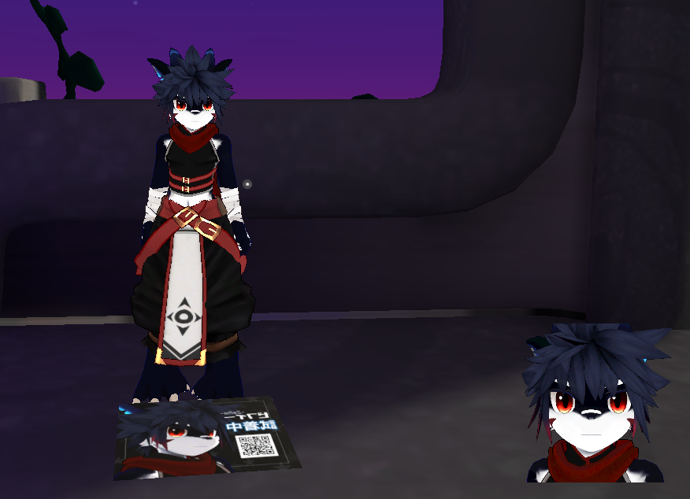
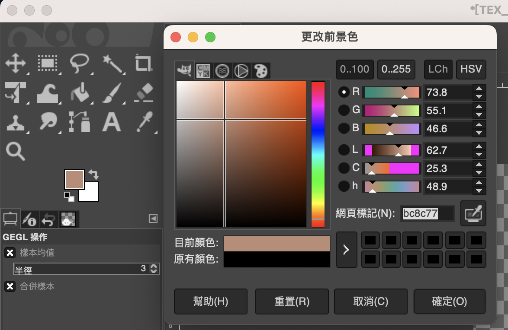
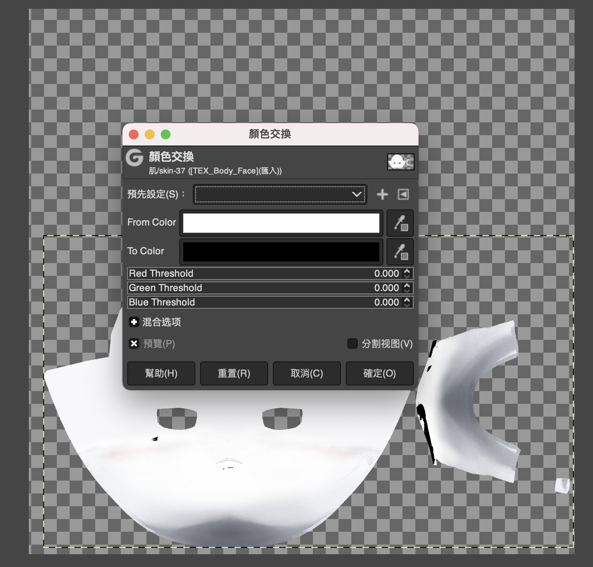
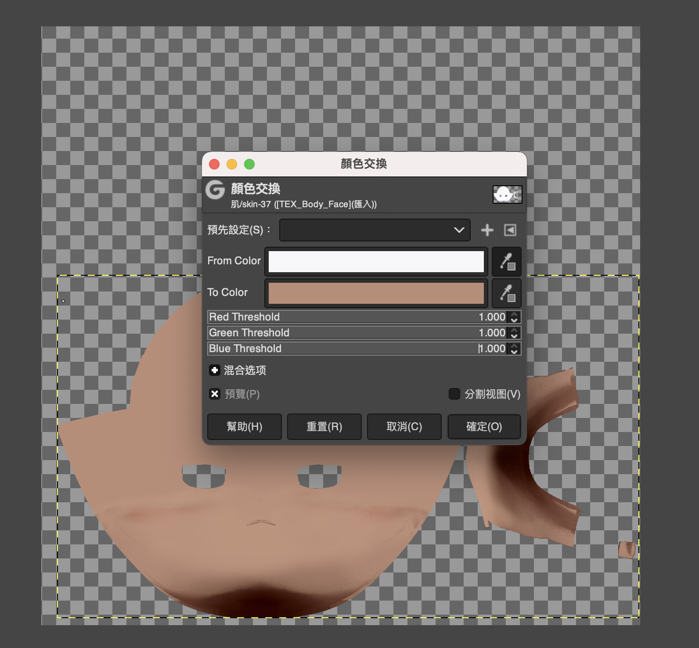
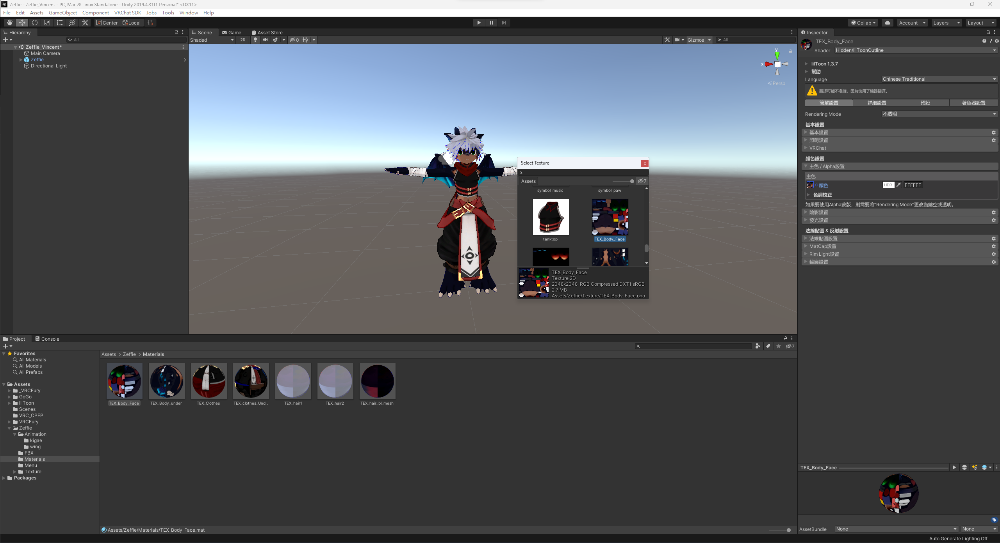

最近熱衷於玩 VRChat，在試用過多個不同的 Furry 模型之後，我最後選擇了 [Zeffie ゼフィー](https://booth.pm/zh-tw/items/4473466) 作為基礎模板。

有鑑於大部份的玩家都會在購買模型之後改變顏色或添增一些圖騰，以更加符合自身的設定，所以我也嘗試著自行修改：




本次的操作皆以這個模型為範例，理論上流程是差不多的，但可能在提供的東西上會有些差異

## 事前準備

- [VRChat Crator Companion](https://vcc.docs.vrchat.com/)：簡稱 VCC，VRChat 官方提供的工具，可以整合 Unity 與一些 Pakcage Manager
- [Unity 2019.4.31f1](https://unity.com/releases/editor/archive#download-archive-2019)：VRChat 官方所推薦的 Unity 版本，建議使用 Unity Hub 進行安裝
    - 僅有這個版本能夠跟 VCC 互相對應，我試過使用 2019.4.40 發現無法綁定
    - 如果不是使用這個版本，需要手動安裝 VRChat SDK
- [GIMP](https://www.gimp.org/)：開源的圖片處理工具
    - 因為我沒有購買 Photoshop，在此以開源軟體取代
- （Optional）[Blender](https://www.blender.org/)：開源的建模工具
    - 因為本次並沒有實際修改到模型本身，所以 Blender 主要是作為檢視器存在，事實上是可以用 Unity 取代的

## 流程

### 以 GIMP 修改 Texture 顏色

購買 Zeffie 並下載並解壓後，可以看到類似於以下的目錄結構：

```
.
├── FBX
│   └── Zeffie.fbx
├── TEXTURE
│   ├── PNG
│   │   ├── TEX_Body_Face.png
│   │   ├── TEX_Body_Face_EM.png
│   │   ├── TEX_Body_under.png
│   │   ├── TEX_Body_under_EM.png
│   │   ├── TEX_Clothes.png
│   │   ├── TEX_Clothes_EM.png
│   │   ├── TEX_clothes_Under.png
│   │   ├── TEX_clothes_Under_EM.png
│   │   ├── TEX_hair1.png
│   │   ├── TEX_hair2.png
│   │   ├── TEX_hair_F_Mask.png
│   │   └── TEX_hair_bl_mesh.png
│   └── PSD
│       ├── TEX_Body_Face.psd
│       ├── TEX_Body_under.psd
│       ├── TEX_Clothes.psd
│       ├── TEX_clothes_Under.psd
│       ├── TEX_hair.psd
│       └── TEX_hair_bl_mesh.psd
├── Zeffie_ver.1.0.2.unitypackage
├── readme.txt
└── 利用規約
    ├── 20230113023605vn3license_en.pdf
    ├── 20230113023605vn3license_ja.pdf
    ├── 20230113023605vn3license_ko.pdf
    └── 20230113023605vn3license_zh.pdf
```

其中，非常貼心地提供了 PSD 檔，這使得我們在修改 Texture 的時候能夠省下不少心力。

以 GIMP 打開 `TEXTURE/PSD/TEX_Body_Face.psd`，並且將不需修改的部份暫且隱藏（圖中我僅留下了「肌/Skin > 肌/Skin」 的項目）：


將此處的白色改成比較深一些的小麥色，例如此處是 `bc8c77`（可以用 GIMP 的調色盤選擇自己喜歡的顏色）



先選定要更改的圖層，再選擇「顏色 > 映射 > 顏色交換」




用 From Color 的拾色器（右邊的滴管）取得臉部的顏色（此處非常接近於白色），再到 To Color 的網頁標記填入 `bc8c77`，最後把下面的 Red Threshold, Green Threshold 及 Blue Threshold 拉到最高。

> 註：有的時候 Threashould 拉到最高並不一定是合適的，可以藉著即時預覽確定是不是自己要的效果



接著把每一個想變化的部份都設定好，如果想要畫上圖騰，可以依賴 [Krita](https://krita.org/zh-tw/) 之類的軟體協助（GIMP 的繪圖功能我一直學不會 OTZ）

最後，把修改後的內容匯出成 PNG（不要把 UV 圖層一起匯出），就算是完成 Texture 的修改

### 在 Unity 中修改 Material

在 Unity 中打開 `Zeffie_ver.1.0.2.unitypackage`，即可匯入 Zeffie 的相關模型資料。

> 註：目前這個版本所使用的渲染器是 [lilToon 1.3.6](https://lilxyzw.github.io/lilToon/#/)，可以在 GitHub 或 Booth 上更新為 1.3.7

將上一步修改後的 Texture 匯入 `Assets/Zeffie/Texture` 中：


將 `Assets/Zeffie/Materials` 的 Material 「主色/Alpha設置」改為新的 Texture



> 註：因為我沒有修改發光的 Texture，所以這邊我取消了「發光設置」

## 參考資料

1. [(EASY) How to Change Avatar Texture Colours in GIMP | VRChat Unity Tutorial](https://www.youtube.com/watch?v=fSW4PCOog0E)